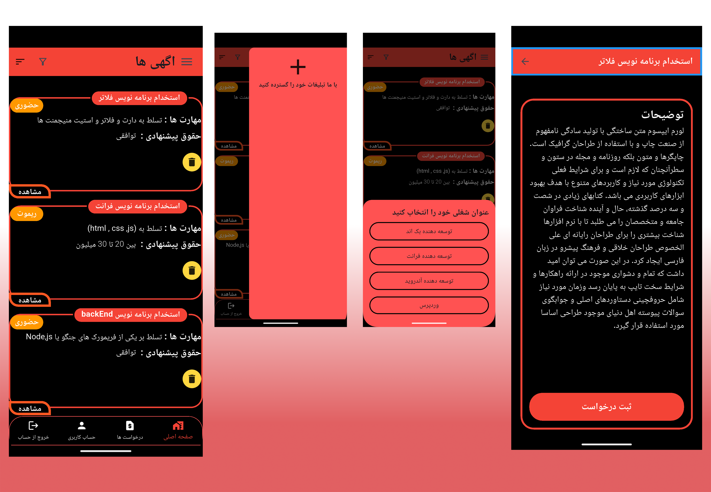

# Advertising App
# Advertising

Advertising is a modern Flutter-based job search application designed to help users discover and explore job opportunities across various industries and professions.

## Features

* Search for jobs in different categories
* User-friendly and responsive interface
* Job details and descriptions
* Easy navigation between screens
* Modern Flutter UI components
* Cross-platform support (Android & iOS)

## Technologies Used

* Flutter
* Dart
* Material Design

## Purpose

The goal of this project is to provide a simple and efficient platform where users can find job opportunities that match their skills, interests, and career goals.

## Screenshots



## Installation

1. Clone the repository:

```bash
git clone https://github.com/Aref18/Advertising.git
```

2. Navigate to the project folder:

```bash
cd Advertising
```

3. Install dependencies:

```bash
flutter pub get
```

4. Run the application:

```bash
flutter run
```

## Author

Developed by Aref V.

